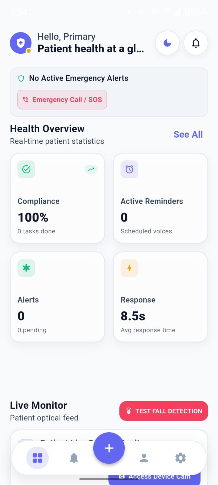
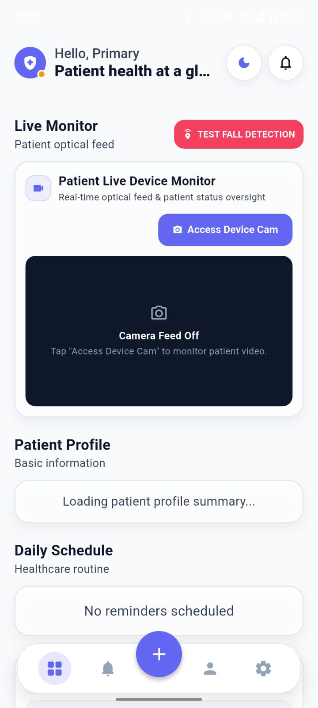
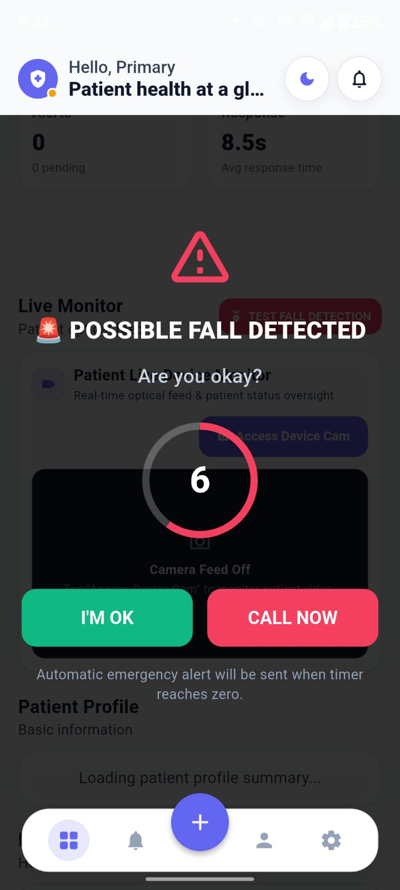
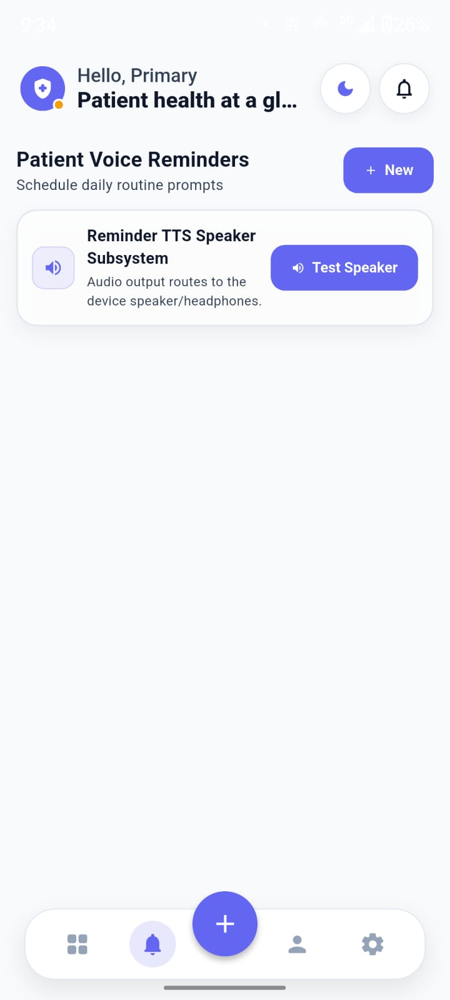

# 🏥 CareVoice-Edge

### Privacy-Preserving Patient Monitoring & Voice-Assisted Healthcare Application

<p align="center">
  A Flutter-based mobile application designed to help caregivers monitor
  patients, manage healthcare routines, and respond to important patient events.
</p>

<p align="center">


</p>

---

## 📌 Project Overview

**CareVoice-Edge** is a Flutter-based healthcare monitoring application designed to support caregivers in monitoring patients, managing daily healthcare routines, and responding to important patient events.

The application provides a centralized interface for patient monitoring, fall detection alerts, emergency response, voice assistance, and patient reminders.

The project focuses on providing a simple and accessible interface for caregivers to monitor patient status and respond to potential emergency situations.

---

## ✨ Key Features

### 🏥 Patient Health Dashboard

- Patient health overview
- Health statistics display
- Alert status
- Reminder status
- Response information
- Centralized caregiver dashboard

### 📹 Live Patient Monitoring

- Patient live monitoring interface
- Camera access interface
- Patient activity monitoring
- Patient status display

### 🚨 Fall Detection & Emergency Response

- Fall detection testing interface
- Possible fall alert
- Emergency countdown
- Patient safety confirmation
- Emergency Call / SOS option

### 🔊 Voice Assistance

- Voice monitoring interface
- Patient voice response
- Voice check functionality
- Voice prompt status

### ⏰ Patient Voice Reminders

- Daily healthcare reminders
- Voice reminder interface
- Reminder scheduling
- Speaker testing functionality

---

## 📸 App Preview

<div align="center">

<table>
<tr>

<td align="center">
<br>
<b>Caregiver Dashboard</b>
</td>

<td align="center">
<br>
<b>Live Patient Monitoring</b>
</td>

<td align="center">
<br>
<b>Fall Detection & Emergency Alert</b>
</td>

</tr>

<tr>

<td align="center">
<br>
<b>Patient Voice Reminders</b>
</td>

</tr>
</table>

</div>

---

## 🔄 Application Workflow

```text
        Patient
           │
           ↓
   Patient Activity / Input
           │
           ↓
    CareVoice-Edge App
           │
           ↓
   Activity Monitoring
           │
           ↓
   Alert / Status Display
           │
           ↓
       Caregiver
 ```
    

###🛠️ Technology Stack

| Category | Technology |
|---|---|
| Framework | Flutter |
| Programming Language | Dart |
| Platform | Android |
| Development IDE | Android Studio |
| Version Control | Git |
| Repository | GitHub |
```

## 📂 Project Structure

```text
CareVoice-Edge/
│
├── android/
│
├── lib/
│   ├── models/
│   ├── providers/
│   ├── screens/
│   ├── services/
│   ├── theme/
│   └── widgets/
│
├── screenshots/
│   ├── dashboard.png
│   ├── live-monitor.png
│   ├── fall-alert.png
│   └── voice-reminders.png
│
├── test/
├── pubspec.yaml
└── README.md
```

## ⚙️ Installation & Setup

### Prerequisites

- Flutter SDK
- Dart SDK
- Android Studio
- Android device or Android Emulator
- Git

### Clone the Repository

```bash
git clone https://github.com/prachimishra01/CareVoice-Edge.git
```

### Open the Project

```bash
cd CareVoice-Edge
```

### Install Dependencies

```bash
flutter pub get
```

### Run the Application

```bash
flutter run
```
---

## 🎯 Project Objective
The objective of CareVoice-Edge is to provide a simple and accessible mobile application that assists caregivers in monitoring patients, managing healthcare routines, and responding to important patient events.

The application is designed with a focus on usability, privacy, and caregiver support.